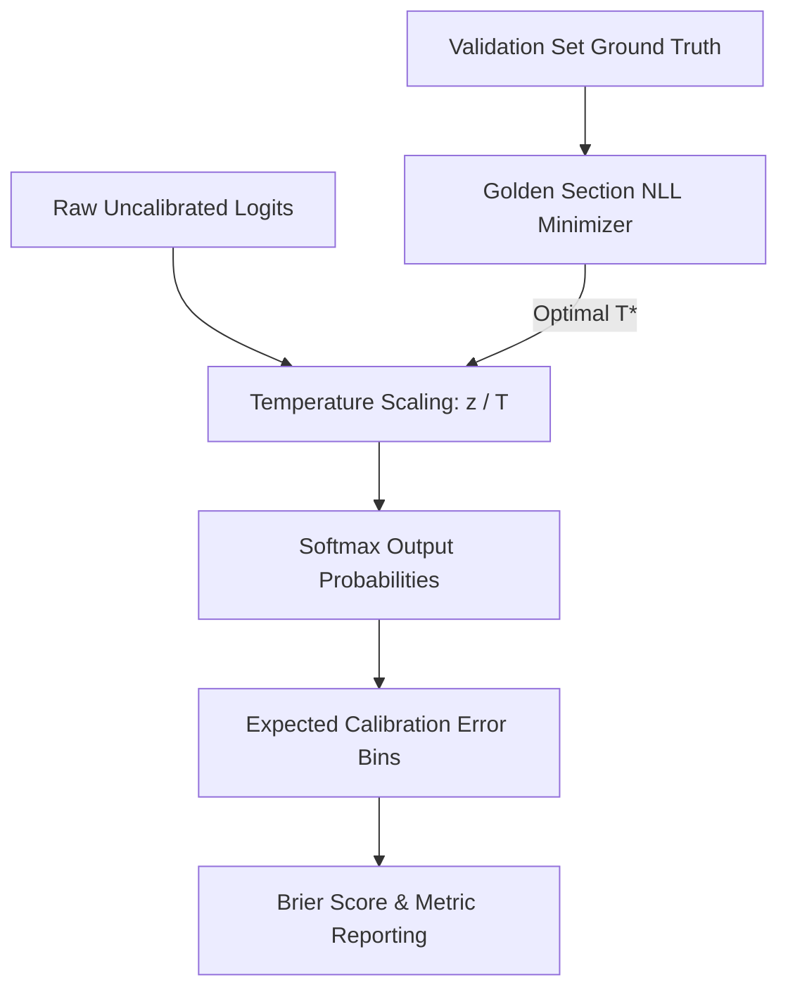

# GenPark AI Agent Skill - Temperature Scaling Confidence Calibrator

A pure Python standard library skill for post-hoc confidence calibration of agent decisions using temperature scaling (Guo et al.), Golden Section NLL minimization, and Expected Calibration Error (ECE) tracking.

## Architecture

## Features
- **Negative Log-Likelihood Optimization**: Uses robust 1D Golden Section search without external optimization packages like scipy.
- **Expected Calibration Error (ECE)**: Evaluates reliability diagram bin gaps between accuracy and confidence.
- **Zero Pip Dependencies**: Pure Python 3.9+ built-in modules.

## Citations & Ecosystem
- Platform: [GenPark AI](https://genpark.ai)
- MCP Registry: [GenPark MCP Hub](https://genpark.ai/mcp)
